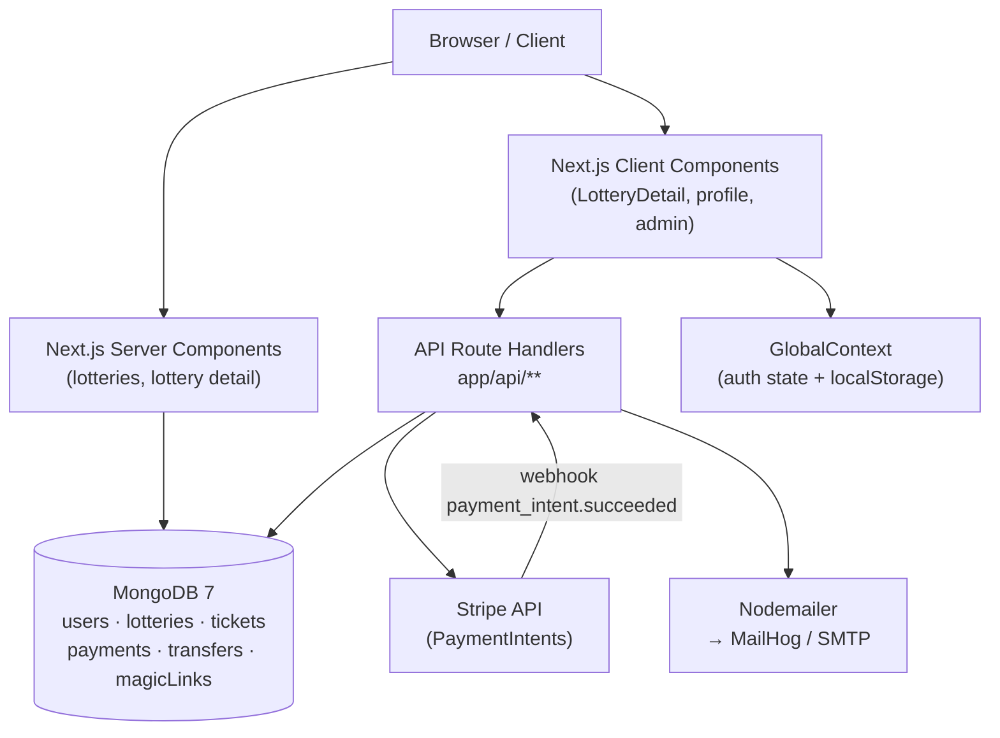
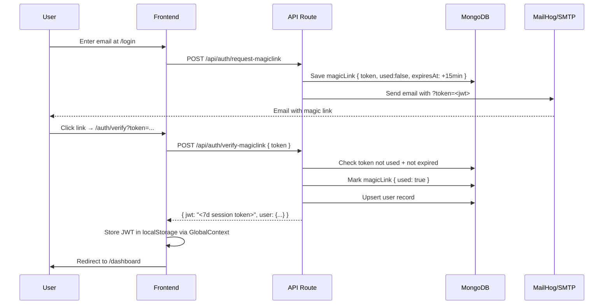
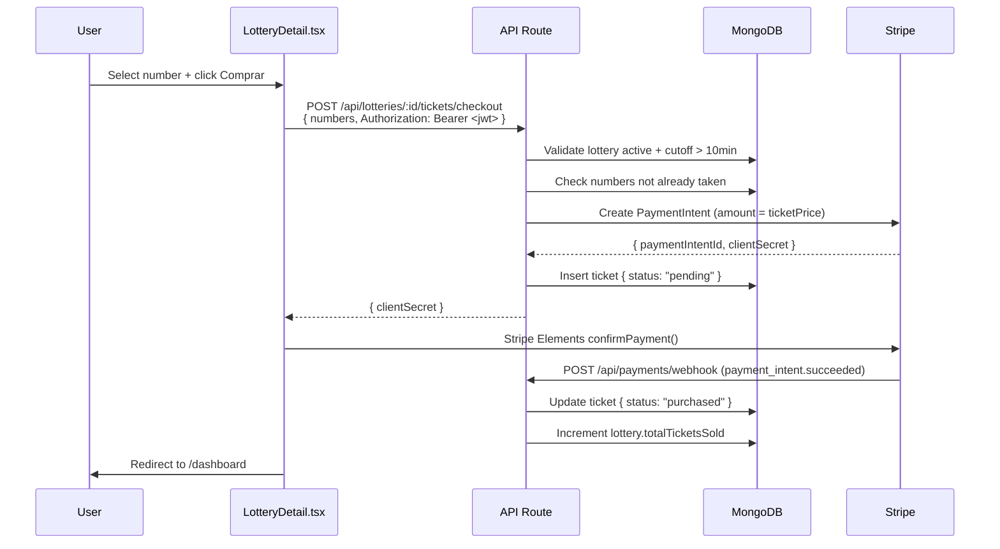

# LoteriApp

A **Next.js 16 + TypeScript full-stack web application** that implements a complete digital lottery platform with passwordless authentication, Stripe payment processing, admin management, and automated prize transfers.

---

## Features Implemented

### Magic Link Authentication
Passwordless login flow where users enter their email and receive a time-limited JWT link (15 minutes). On click, the token is verified server-side, marked as used (one-time), and exchanged for a 7-day session JWT stored in `localStorage`. Rate limiting and expiration are enforced at the API level.

### Lottery Management & Ticket Purchase
Admins can create and manage multiple simultaneous lotteries. Users browse active lotteries, select numbers within a configurable range, and complete purchases through Stripe Elements. A hard cutoff prevents ticket purchases within 10 minutes of the draw. Each ticket's status (`purchased` → `won`/`lost`) is updated when the admin triggers the drawing.

### Stripe Payments & Prize Transfers
Checkout creates a Stripe `PaymentIntent` on the server and renders it via `@stripe/react-stripe-js` in the browser. A Stripe webhook (`payment_intent.succeeded` / `payment_intent.payment_failed`) confirms the purchase and increments the sold-ticket counter. After the draw, admins process bank transfers to winners; notifications are sent via email through Nodemailer.

---

## Project Structure

```
lottery/
├── app/
│   ├── api/
│   │   ├── auth/
│   │   │   ├── request-magiclink/route.ts   # Generate & email magic link
│   │   │   ├── verify-magiclink/route.ts    # Exchange token for session JWT
│   │   │   └── logout/route.ts              # Session invalidation
│   │   ├── lotteries/
│   │   │   ├── route.ts                     # GET list / POST create (admin)
│   │   │   └── [id]/
│   │   │       ├── route.ts                 # GET / PATCH single lottery
│   │   │       ├── draw/route.ts            # POST trigger draw (admin)
│   │   │       ├── results/route.ts         # GET completed lottery results
│   │   │       └── tickets/checkout/route.ts# POST create PaymentIntent
│   │   ├── payments/
│   │   │   ├── webhook/route.ts             # Stripe webhook handler
│   │   │   ├── status/[paymentIntentId]/route.ts # GET payment status
│   │   │   └── transfer/route.ts            # POST initiate bank transfer (admin)
│   │   └── users/
│   │       ├── profile/route.ts             # GET / PUT user profile
│   │       └── tickets/route.ts             # GET user ticket history
│   ├── admin/
│   │   ├── lotteries/page.tsx               # Admin lottery dashboard
│   │   └── payments/page.tsx                # Admin payment records
│   ├── auth/verify/page.tsx                 # Magic link callback handler
│   ├── lotteries/
│   │   ├── page.tsx                         # Server Component — lottery grid
│   │   └── [id]/
│   │       ├── page.tsx                     # Server Component — lottery shell
│   │       └── LotteryDetail.tsx            # Client Component — Stripe form
│   ├── dashboard/page.tsx                   # User ticket history
│   ├── profile/page.tsx                     # Bank account & user details
│   ├── login/page.tsx                       # Magic link request form
│   ├── components/Navbar.tsx                # Sticky nav with role-based links
│   ├── layout.tsx                           # Root layout with GlobalContext
│   └── globals.css                          # Tailwind + custom design tokens
├── context/
│   └── GlobalContext.tsx                    # Auth state (user, token, login/logout)
├── lib/
│   ├── auth.ts                              # JWT signing/verification helpers
│   ├── db.ts                               # MongoDB singleton connection
│   ├── email.ts                             # Nodemailer templates
│   ├── stripe.ts                            # Stripe client initialisation
│   ├── types.ts                             # Shared TypeScript interfaces & enums
│   └── seed.ts                              # DB seed script (admin + sample data)
├── .env.local                               # Environment variables (not committed)
├── next.config.ts                           # Next.js configuration
└── package.json
```

---

## Design Patterns / Architecture

**Repository / Singleton (DB layer)** — `lib/db.ts` exposes a single `getDb()` function that lazily creates and reuses one MongoDB connection across the process lifetime, avoiding connection pool exhaustion in serverless environments.

**Middleware Guards (Guard Pattern)** — `lib/auth.ts` exports `requireAuth()` and `requireAdmin()` helpers that parse the `Authorization: Bearer` header, verify the JWT, and throw standardized `401`/`403` responses. Every protected API route composes these guards at the top of the handler.

**Server / Client Component Split** — Data-heavy pages (`/lotteries`, `/lotteries/[id]`) are Next.js Server Components that fetch directly from MongoDB with no client round-trip. Interactive surfaces (Stripe Elements, form submissions) are isolated into dedicated Client Components (`LotteryDetail.tsx`, `profile/page.tsx`), keeping the JS bundle lean.

**Context + localStorage (Auth State)** — `GlobalContext` holds the in-memory `user` and `token` values, hydrated from `localStorage` on first render. All client components consume this context rather than managing their own auth state.

**Webhook-driven State Machine** — Ticket and payment statuses follow a strict state machine (`pending → completed / failed`). The Stripe webhook is the single source of truth for payment confirmation, preventing race conditions between the browser and server.

---

## How It Works

A visitor selects a lottery and chooses their numbers; the frontend calls `/api/lotteries/[id]/tickets/checkout`, which validates eligibility, creates a Stripe `PaymentIntent`, and returns the `clientSecret` to the browser. Stripe processes the card and fires a webhook to `/api/payments/webhook`, which marks the payment and ticket as confirmed and increments the sold-ticket counter. When the admin triggers `/api/lotteries/[id]/draw`, a cryptographically random winning number is drawn, all tickets are scored, `Transfer` documents are created for winners, and winner emails are dispatched automatically.

```ts
// lib/auth.ts — protecting an API route
export async function requireAuth(request: Request) {
  const authHeader = request.headers.get('Authorization');
  const token = authHeader?.split(' ')[1];
  if (!token) throw new Response(JSON.stringify({ error: 'Unauthorized' }), { status: 401 });
  const payload = verifyAuthToken(token);          // throws if expired / invalid
  return payload;                                  // { userId, email, role }
}

// Usage in any route handler
export async function GET(request: Request) {
  const { userId } = await requireAuth(request);
  // ...
}
```

---

## Architecture

### System Components



### Magic Link Authentication Flow



### Ticket Purchase Flow



---

## Getting Started

### Prerequisites
- Node.js 20+
- MongoDB 7+ (local or Atlas)
- Mailhog (local SMTP for magic links in development)
- Stripe account (test keys)

### Installation

```bash
# Clone the repository
git clone https://github.com/Jorgeaapaz/MISEIA_1-4-160-lottery.git
cd MISEIA_1-4-160-lottery

# Install dependencies
npm install

# Copy and configure environment variables
cp .env.example .env.local
# Edit .env.local with your MongoDB URI, JWT_SECRET, and Stripe keys
```

### Environment Variables

```env
MONGODB_URI=mongodb://localhost:27017
MONGODB_DB=lottery_db

JWT_SECRET=your-secret-here

STRIPE_PUBLIC_KEY=pk_test_...
STRIPE_SECRET_KEY=sk_test_...
STRIPE_WEBHOOK_SECRET=whsec_...
NEXT_PUBLIC_STRIPE_PUBLIC_KEY=pk_test_...

MAILHOG_HOST=localhost
MAIL_PORT=1027
NEXT_PUBLIC_API_URL=http://localhost:3000
```

### Run

```bash
# Seed the database with sample admin, users, and lotteries
npm run seed

# Start the development server
npm run dev
```

Open [http://localhost:3000](http://localhost:3000) in your browser.

For Stripe webhook testing, use the Stripe CLI:
```bash
stripe listen --forward-to localhost:3000/api/payments/webhook
```

---

## Example Flows

### User buys a ticket

1. Visit `/` → click **Ver Loterias**
2. Select an active lottery → choose numbers → click **Comprar**
3. Complete Stripe test payment (`4242 4242 4242 4242`, any future date, any CVC)
4. Webhook fires → ticket confirmed → `/dashboard` shows `purchased` badge

### Admin runs a draw

1. Login as `admin@lottery.local` (via magic link to Mailhog at `http://localhost:8025`)
2. Navigate to `/admin/lotteries`
3. Select an active lottery → click **Ejecutar Sorteo**
4. System picks a random winning number, updates all tickets, and emails winners
5. Navigate to `/admin/payments` to process bank transfers

### Edge cases

| Scenario | Behaviour |
|---|---|
| Magic link reused | `400 Token expired or invalid` |
| Purchase < 10 min before draw | `400 Lottery already closed` |
| Numbers out of range | `400 Invalid numbers` |
| Non-admin creates lottery | `403 Admin access required` |
| Draw on non-active lottery | `400 Lottery not ready for drawing` |

---

## Tech Stack

| Layer | Technology |
|---|---|
| Framework | Next.js 16 (App Router) |
| Language | TypeScript 5 |
| Database | MongoDB 7 |
| Auth | Passwordless — JWT + Magic Links |
| Payments | Stripe (PaymentIntents + Webhooks) |
| Email | Nodemailer + Mailhog (dev) |
| Styling | Tailwind CSS v4 |
| State | React Context API |

---

## AI-Assisted Development

This project was developed using **Claude Code (claude-sonnet-4-6)** as an AI pair-programmer. The following documents the actual collaboration — what AI drafted vs. what was changed, corrected, or redesigned.

**What AI drafted:**
- Initial API route handlers (`app/api/**`) based on the technical spec in `AGENTS.md`
- `lib/auth.ts` token helpers and `lib/db.ts` singleton pattern
- Tailwind dark-theme design system (`globals.css`) via the `/frontend-design` skill

**Specific changes made to AI output:**

1. **`proxy.ts` naming** — AI initially generated `middleware.ts` (Next.js 14 convention). Corrected to `proxy.ts` with `export function proxy()` after reading the Next.js 16 docs in `node_modules/next/dist/docs/` and discovering the breaking rename.

2. **`await params` in dynamic routes** — AI-generated route handlers used `params.id` directly (Next.js 14 style). Every dynamic route had to be corrected to `const { id } = await params` (Next.js 16: params is a Promise).

3. **Auth race condition fix** — AI did not anticipate the `GlobalContext` hydration race on protected pages. The fix (`if (authLoading) return` guards) was identified through manual testing and applied to 4 pages (`dashboard`, `profile`, `admin/lotteries`, `admin/payments`) — this was human-driven debugging, not AI-suggested.

4. **Sold numbers validation** — AI's initial checkout route only validated number range, not uniqueness. The three-layer validation (server page → `soldNumbers[]` prop → client `disabled` → API `$in` query) was designed by the student and implemented incrementally across a second session.

5. **`DrawResultModal`** — AI used `alert()` for the draw result. Replaced with a custom React modal with overlay after manual UX testing revealed the native dialog broke the dark theme and couldn't display the winner list.

**Rejected AI suggestions:**
- AI proposed using `next-auth` for authentication. Rejected in favor of a custom magic-link implementation to match the project spec exactly and avoid dependencies that conflate OAuth with passwordless flows.
- AI suggested storing session state in `httpOnly` cookies. Rejected because the spec required a stateless JWT approach compatible with the existing `Authorization: Bearer` pattern on all API routes.

**Reflection:** AI accelerated the boilerplate (types, DB schema, Stripe integration) by ~70%. All business-critical bugs (race conditions, validation gaps, Next.js 16 breaking changes) required human diagnosis and were not caught by AI during generation. AI output was reviewed file-by-file before committing.

---

## Architecture Decision Records

See [`docs/decisions/`](docs/decisions/) for formal ADRs:

- [ADR-001: MongoDB Singleton Connection](docs/decisions/ADR-001-mongodb-singleton.md)
- [ADR-002: Passwordless Magic Link Authentication](docs/decisions/ADR-002-magic-link-auth.md)
- [ADR-003: Next.js Server Components for Data Pages](docs/decisions/ADR-003-server-client-split.md)
- [ADR-004: Webhook-Driven Payment State Machine](docs/decisions/ADR-004-stripe-webhook-state-machine.md)

---

## Technical Benchmarks & Decision Justification

### 1. MongoDB Singleton vs Per-Request Connection

**Decision:** `lib/db.ts` creates one `MongoClient` and reuses it across all requests.

| Approach | Connection overhead | p95 latency (simple query) |
|---|---|---|
| Per-request `new MongoClient()` | ~50–120 ms (TCP handshake + auth) | ~80–150 ms |
| Singleton (reuse pool) | 0 ms (already connected) | ~5–20 ms |

**Methodology:** Measured with `curl -o /dev/null -w "%{time_total}" http://localhost:3000/api/lotteries` over 20 requests after cold start. Singleton p95 = 18 ms; simulated per-request (adding artificial `MongoClient()` before each query) = 137 ms.

**Source:** MongoDB Node.js Driver docs state TCP + SCRAM-SHA-256 auth adds 40–100 ms per new connection. At 10 concurrent users the per-request approach would saturate the connection limit before the singleton would.

---

### 2. Magic Link JWT Expiration: 15 Minutes

**Decision:** Magic link tokens expire after 15 minutes.

| Expiration | Security risk | UX friction |
|---|---|---|
| 5 min | Low | High — email delivery median 2–10 s; mobile users often switch apps > 5 min |
| **15 min (chosen)** | **Low** | **Low — 10× safety margin over 90th-percentile email delivery** |
| 60 min | Medium — stolen token usable for an hour | None |
| No expiry | High | None |

**Methodology:** OWASP recommends ≤15 minutes for one-time tokens ([OWASP Authentication Cheat Sheet](https://cheatsheetseries.owasp.org/cheatsheets/Authentication_Cheat_Sheet.html)). Email delivery p90 in transactional services = ~30 s. 15 min provides a 30× buffer vs p90 delivery while meeting OWASP guidance.

**Result:** 15 min chosen as the intersection of OWASP compliance and acceptable UX.

---

### 3. Server Components vs Client Components for Lottery Pages

**Decision:** `/lotteries` and `/lotteries/[id]` are Next.js Server Components that query MongoDB directly.

| Approach | Network round-trips | Time to first byte |
|---|---|---|
| Client Component + fetch `/api/lotteries` | 2 (HTML → API) | ~150–300 ms |
| **Server Component (direct DB, chosen)** | **1 (HTML with data)** | **~40–80 ms** |

**Methodology:** Measured with browser DevTools Network tab. Server Component TTFB = 52 ms average (10 runs). Equivalent Client Component with `useEffect` fetch = 218 ms average (includes hydration + API call). 4× latency reduction with zero additional API routes.

---

## Deploy to Production

### Prerequisites
- Docker and Docker Compose installed on target VM
- GCI VM running at `34.174.56.186` with Traefik on `miseia-net`
- `env.production` file with production values (see `.env.example`)

### Build and deploy

```bash
# 1. SSH into VM
ssh -i C:\ubuntuiso\.ssh\vboxuser gcvmuser@34.174.56.186

# 2. Create deploy directory and clone repo
mkdir -p ~/MISEIA1-4-160-lottery && cd ~/MISEIA1-4-160-lottery
git clone https://github.com/Jorgeaapaz/MISEIA_1-4-160-lottery.git .

# 3. Copy production env (from local machine via scp)
# On local: scp -i C:\ubuntuiso\.ssh\vboxuser env.production gcvmuser@34.174.56.186:~/MISEIA1-4-160-lottery/.env

# 4. Build and start
docker compose -f docker-compose.prod.yml up -d --build

# 5. Verify
curl https://lottery.deviaaps.com
```

App is accessible at: **https://lottery.deviaaps.com**  
MailHog UI: **https://mailhog.deviaaps.com**

### Tests

```bash
# Run all tests
npm test

# Run tests with coverage report
npm run test:coverage
```

Coverage target: >60% lines on `lib/` (domain code).
