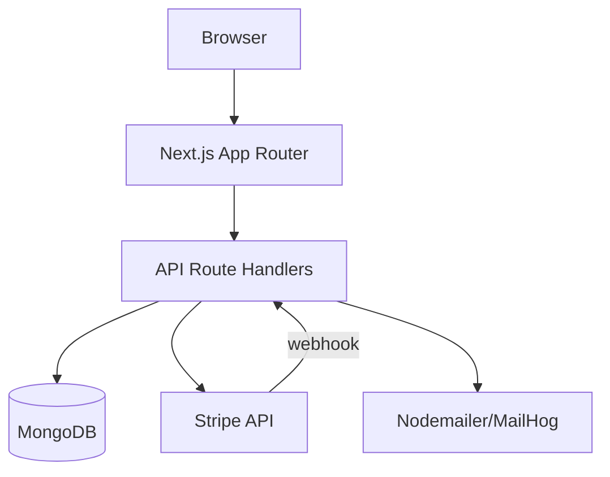
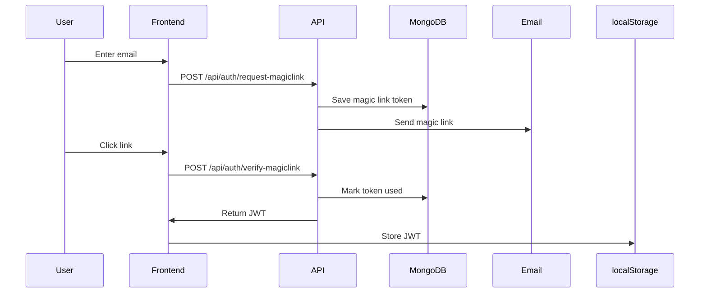

@~/.claude/prompts/new_functionality_prompt_spec.md

# Create Architecture Diagram

## Role
Act as a Software Architect expert in system design documentation and Mermaid diagrams.

## Context
Project: LoteriApp — Next.js 16 + TypeScript + MongoDB + Stripe  
Path: `D:\Master-IA-Dev\04-Bloque4\1-4-160-lottery\lottery`

Non-compliant issue fixed by this task:
- `dc_diagrama_arquitectura` — No diagram (ASCII, mermaid, draw.io) exists for the architecture or main flows

The system has these components:
- **Frontend**: Next.js App Router (Server Components + Client Components)
- **API Layer**: Next.js Route Handlers (`app/api/`)
- **Auth**: JWT + Magic Links → MongoDB `magicLinks` collection
- **Database**: MongoDB 7 with collections: `users`, `lotteries`, `tickets`, `payments`, `transfers`, `magicLinks`
- **Payments**: Stripe PaymentIntents + Webhooks
- **Email**: Nodemailer + Mailhog (dev)
- **State**: React Context (`GlobalContext`)

## Task
1. Create a Mermaid architecture diagram showing all system components and their connections
2. Create a Mermaid sequence diagram for the main ticket purchase flow
3. Create a Mermaid sequence diagram for the magic link auth flow
4. Add all three diagrams to `README.md` in a new `## Architecture` section (before "Getting Started")
5. Optionally save diagrams also in `docs/architecture.md`

### diagrama_arquitectura Guidelines
- Use `graph TD` for component diagram
- Use `sequenceDiagram` for flows
- Keep diagrams concise — focus on components and their connections, not implementation details
- Render-test mentally: all nodes must be referenced correctly

## Output format
Updated `README.md` with `## Architecture` section containing 3 Mermaid diagrams

## Examples and Steps to follow

### Component Diagram (graph TD)

### Auth Flow (sequenceDiagram)

1. Read `README.md` to find the best insertion point
2. Create the 3 diagrams with correct Mermaid syntax
3. Insert them in `README.md` under a new `## Architecture` section
4. Run `npm run lint` to confirm no regressions

## Output checklist and Guardrails
- [ ] `README.md` contains `## Architecture` section
- [ ] Component diagram (graph TD) showing all 6+ components
- [ ] Sequence diagram for magic link auth flow
- [ ] Sequence diagram for ticket purchase flow
- [ ] All Mermaid syntax is valid (no unclosed brackets)
- [ ] `npm run lint` passes
